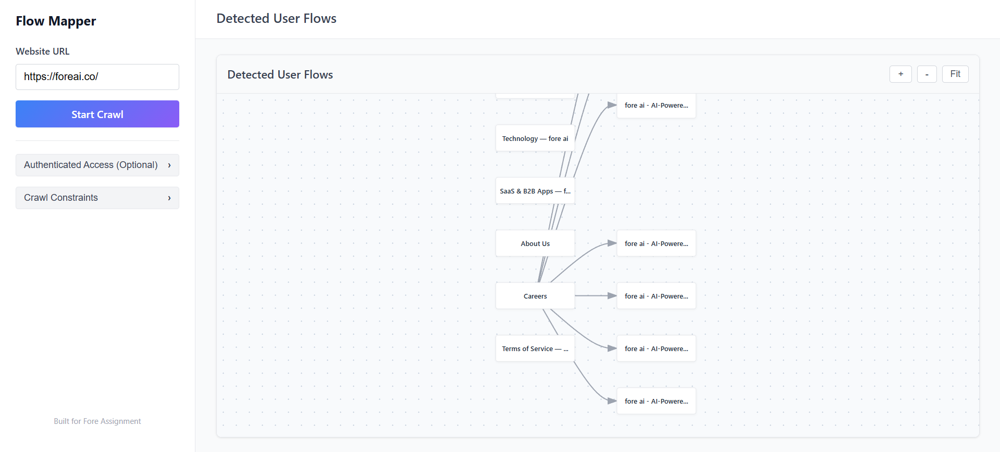

# Intelligent User Flow Mapper

A smart web crawler that analyzes websites and produces clean, noise-reduced user flow diagrams. Built as a solution to foreai assignment focusing on intelligent noise reduction and meaningful user navigation path extraction.

## 🎯 Project Overview

This application crawls websites and creates visual representations of user navigation flows, with a key focus on **reducing noise** by filtering out global navigation elements (headers, footers) that don't represent actual user journeys.

### Key Features

- **Smart Crawling**: Server-side crawler with depth control, duplicate detection, and loop prevention
- **Intelligent Noise Reduction**: 4-layer heuristic system to filter out redundant navigation
  - 70% frequency threshold for global navigation detection
  - Context-based link classification (nav/footer vs main/article)
  - Redundant edge elimination
  - Page type classification (entry/content/utility)
- **Interactive Visualization**: D3.js force-directed graph with zoom, pan, and drag
- **Modern UI**: Clean, responsive interface with gradient design and real-time feedback

## Architecture

**Hybrid Architecture**: Vue.js frontend + Node.js/Express backend

```
FlowMapper/
├── backend/          # Node.js/Express API server
│   ├── server.js     # Express server with /api/crawl endpoint
│   ├── crawler.js    # Breadth-first web crawler
│   ├── parser.js     # Cheerio-based HTML parsing
│   ├── noiseReducer.js  # Core noise reduction algorithms
│   └── urlUtils.js   # URL manipulation utilities
└── frontend/         # Vue.js 3 application
    └── src/
        ├── components/
        │   ├── InputForm.vue      # Crawl configuration
        │   ├── FlowDiagram.vue    # D3.js visualization
        │   ├── LoadingState.vue   # Progress indicator
        │   └── ErrorDisplay.vue   # Error handling
        ├── services/
        │   ├── apiClient.js       # Backend API communication
        │   └── graphBuilder.js    # D3 data transformation
        └── styles/
            ├── main.css           # CSS variables & base
            ├── layout.css         # Flexbox layouts
            └── components.css     # Component styling
```

### Why Hybrid Architecture? (Why Node.js?)

1.  **CORS & Security Restrictions**: Browsers strictly block Cross-Origin Resource Sharing. A frontend running on `localhost:5173` cannot programmatically fetch HTML from `google.com` or `foreai.co`. A backend proxy is *mandatory* to bypass this limitation.
2.  **Performance**: Parsing 100+ HTML pages, running heuristics, and calculating graph metrics is CPU-intensive. Offloading this to a Node.js server keeps the frontend UI responsive.
3.  **Networking Capabilities**: Node.js has full raw socket access to handle redirects, SSL handshakes, and headers that browsers abstract away.
4.  **Scalability**: A backend architecture allows for future potential features like saving crawl history, rate limiting across multiple users, or distributed crawling.

## 🚀 Installation & Setup

### Prerequisites

- Node.js 18+ and npm

### Backend Setup

```bash
cd backend
npm install
npm start
```

The backend API will run on `http://localhost:3000`

### Frontend Setup

```bash
cd frontend
npm install
npm run dev
```

The frontend will run on `http://localhost:5173`

## 📖 Usage

1. **Enter Website URL**: Provide the starting URL to crawl
2. **Configure Options**:
   - Max Depth: How many levels deep to crawl (1-5)
   - Max Pages: Maximum number of pages to analyze (10-100)
   - Authentication: Optional basic auth credentials
3. **Start Crawl**: Click "Start Crawl" and wait for analysis
4. **Explore Flow**: Interact with the generated flow diagram
   - **Zoom**: Scroll to zoom in/out
   - **Pan**: Click and drag background
   - **Move Nodes**: Drag individual nodes
   - **Hover**: View page titles and URLs

## 🧠 Noise Reduction Approach

The core differentiator of this application is intelligent noise reduction:

### 1. Global Navigation Detection (70% Threshold)

Links appearing on more than 70% of pages are classified as global navigation:

```javascript
if (linkFrequency / totalPages > 0.70) {
  // This is global nav (header/footer)
  // Don't create redundant edges
}
```

### 2. Context-Based Classification

Links are scored based on their HTML context:

- **Primary** (score: 3): Links in `<main>` or `<article>` tags
- **Navigation** (score: 0.5): Links in `<nav>` or `<header>` tags
- **Footer** (score: 0.3): Links in `<footer>` tags

### 3. Redundant Edge Elimination

If a connection exists via global navigation, we don't duplicate it in the content flow.

### 4. Page Type Filtering

Utility pages (404, login, search) are filtered from the main flow visualization.

## 🎨 Design Decisions

### Technology Stack

- **Vue.js 3**: Modern, reactive framework with Composition API
- **D3.js**: Industry-standard visualization library for learning and flexibility
- **Express**: Lightweight backend for CORS bypass and server-side crawling
- **Cheerio**: Fast, jQuery-like HTML parsing
- **Bare CSS + Flexbox**: Maximum control without framework overhead

### Why D3.js over Pre-built Libraries?

D3.js provides learning opportunities and full control over visualization, demonstrating engineering depth rather than just library integration.

## 🧪 Testing

### Test with Sample Sites

1. **Small Static Site** (3-10 pages): Test basic crawling
2. **Medium Blog** (20-50 pages): Test noise reduction effectiveness
3. **Documentation Site**: Test depth control and link classification

### Example Test URLs

- `https://foreai.co/` - Simple static site
- Any small documentation site with clear navigation structure



### Example Server Log

```
Received crawl request: { startUrl: 'https://foreai.co/', maxDepth: 5, maxPages: 50 }
Starting crawl from: https://foreai.co/
Max depth: 5, Max pages: 50
Crawling (depth 0): https://foreai.co/
Crawling (depth 1): https://foreai.co/products/web
Crawling (depth 1): https://foreai.co/products/mobile
Crawling (depth 1): https://foreai.co/products/test-management
Crawling (depth 1): https://foreai.co/products/integrations
Crawling (depth 1): https://foreai.co/customers/finance
Crawling (depth 1): https://foreai.co/customers/insurance
Crawling (depth 1): https://foreai.co/customers/travel
Crawling (depth 1): https://foreai.co/customers/media
Crawling (depth 1): https://foreai.co/customers/retail
Crawling (depth 1): https://foreai.co/customers/technology
Crawling (depth 1): https://foreai.co/customers/saas
Crawling (depth 1): https://foreai.co/about
Crawling (depth 1): https://foreai.co/careers
Crawling (depth 1): https://foreai.co/terms
Crawling (depth 2): https://foreai.co/product
Error crawling https://foreai.co/product: Request failed with status code 404
Crawling (depth 2): https://foreai.co/demo
Error crawling https://foreai.co/demo: Request failed with status code 404
Crawling (depth 2): https://foreai.co/careers/customer-success-manager
Crawling (depth 2): https://foreai.co/careers/full-stack-engineer
Crawling (depth 2): https://foreai.co/careers/go-to-market-intern
Crawling (depth 2): https://foreai.co/careers/ml-quality
Crawling (depth 2): https://foreai.co/careers/product-ops-associate
Crawling (depth 2): https://foreai.co/careers/software-engineer-infra
Crawling (depth 2): https://foreai.co/careers/technical-solutions-engineer
Crawl complete. Visited 22 pages.
Building clean graph...
Global nav detected: https://foreai.co/ (appears on 22/22 pages = 100%)
Global nav detected: https://foreai.co/products/web (appears on 22/22 pages = 100%)
Global nav detected: https://foreai.co/products/mobile (appears on 22/22 pages = 100%)
Global nav detected: https://foreai.co/products/test-management (appears on 22/22 pages = 100%)
Global nav detected: https://foreai.co/products/integrations (appears on 22/22 pages = 100%)
Global nav detected: https://foreai.co/customers/finance (appears on 22/22 pages = 100%)
Global nav detected: https://foreai.co/customers/insurance (appears on 22/22 pages = 100%)
Global nav detected: https://foreai.co/customers/travel (appears on 22/22 pages = 100%)
Global nav detected: https://foreai.co/customers/media (appears on 22/22 pages = 100%)
Global nav detected: https://foreai.co/customers/retail (appears on 22/22 pages = 100%)
Global nav detected: https://foreai.co/customers/technology (appears on 22/22 pages = 100%)
Global nav detected: https://foreai.co/customers/saas (appears on 22/22 pages = 100%)
Global nav detected: https://foreai.co/about (appears on 22/22 pages = 100%)
Global nav detected: https://foreai.co/careers (appears on 22/22 pages = 100%)
Global nav detected: https://foreai.co/terms (appears on 22/22 pages = 100%)
Page classification: 0 entry, 22 content, 0 utility
Noise reduction: 361 raw links -> 9 clean links (98% reduction)   
Graph built: 22 nodes, 9 edges
```

## 🔧 Configuration

### Backend Configuration

Edit `backend/server.js`:

```javascript
const PORT = process.env.PORT || 3000;
```

### Crawl Limits

Maximum limits (for safety):

- Max Depth: 5 levels
- Max Pages: 100 pages
- Timeout: 10 seconds per page

## 👤 Author

Built for foreai assignment.

---

**Note**: This is an educational project demonstrating web crawling, graph algorithms, and data visualization. Always respect website terms of service when crawling.
